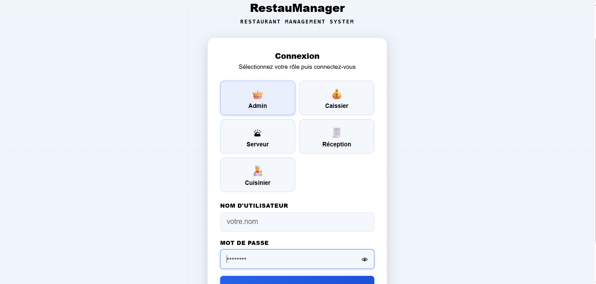
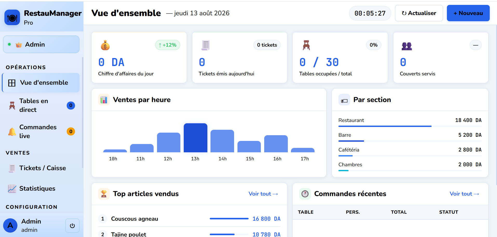
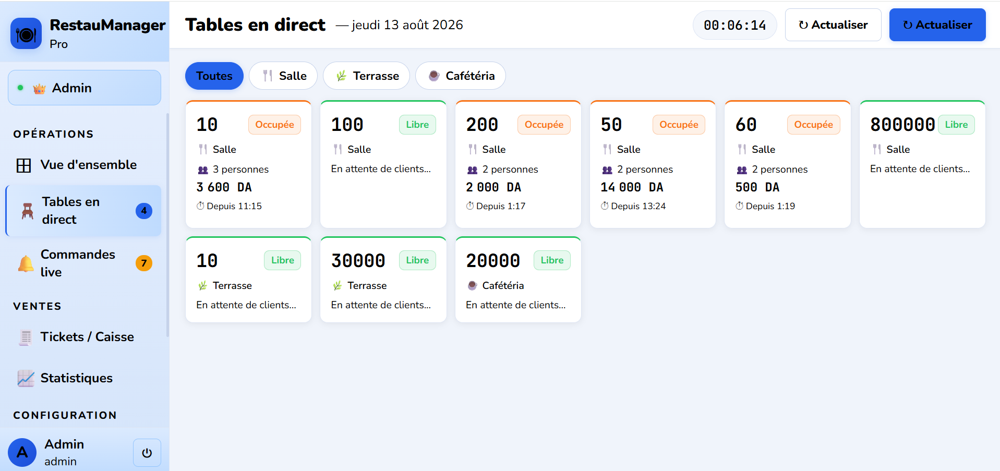
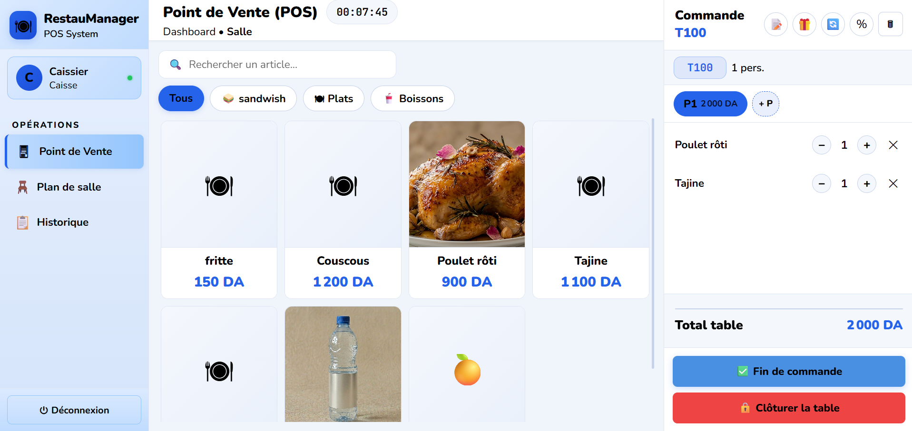
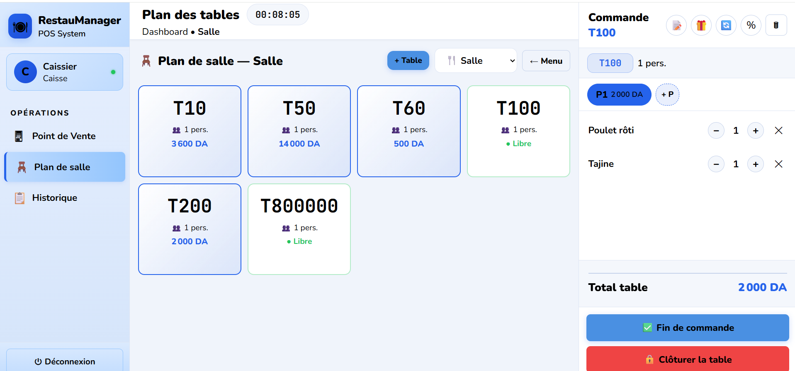
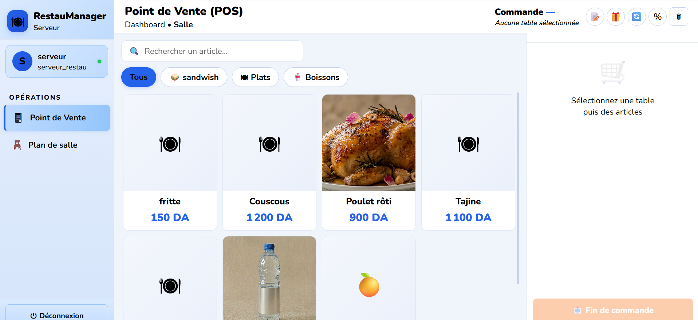
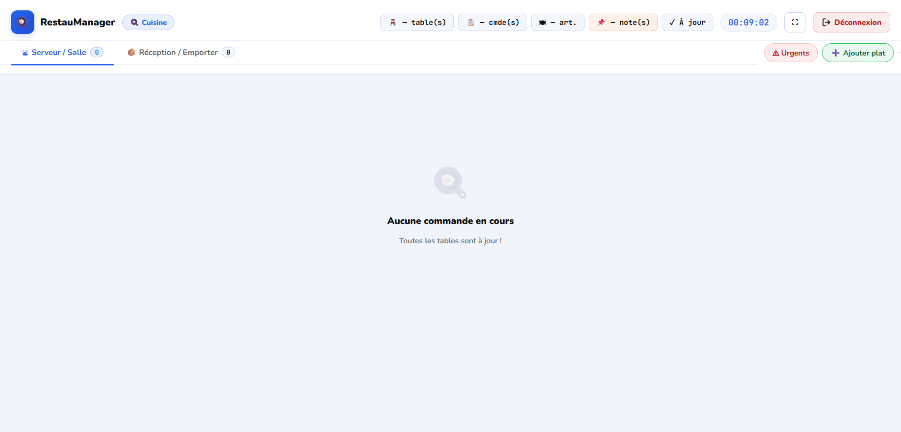
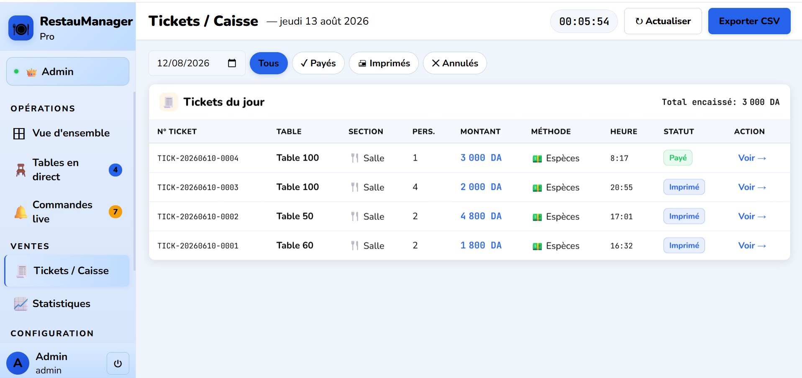
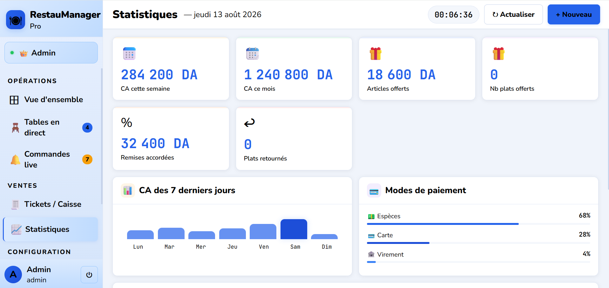

# 🍽️ RestauManager

**Système de gestion de restaurant complet**, événementiel et temps réel — de la prise de commande en salle jusqu'à l'encaissement, en passant par la cuisine, la réception et les statistiques, avec une interface dédiée à chaque rôle.


---

## 📖 Sommaire

- [À propos](#-à-propos)
- [Fonctionnalités](#-fonctionnalités)
- [Aperçu de l'application](#-aperçu-de-lapplication)
- [Architecture technique](#-architecture-technique)
- [Stack technique](#-stack-technique)
- [Points techniques notables](#-points-techniques-notables)
- [Installation](#-installation)
- [Utilisation](#-utilisation)
- [Structure du projet](#-structure-du-projet)
- [Rôles et permissions](#-rôles-et-permissions)
- [Auteur](#-auteur)

---

## 📝 À propos

RestauManager est une application web complète de gestion de restaurant, pensée pour couvrir l'ensemble du flux opérationnel : de la prise de commande en salle jusqu'à l'encaissement, en passant par la cuisine et le suivi des statistiques. L'application propose une interface différente selon le rôle de l'utilisateur connecté, avec une synchronisation en temps réel entre les différents postes (salle, cuisine, caisse).

## ✨ Fonctionnalités

- 🔐 **Authentification par rôle** : Admin, Caissier, Serveur, Réception, Cuisinier
- 📊 **Tableau de bord Admin** : chiffre d'affaires du jour, tickets émis, taux d'occupation des tables, ventes par heure, top articles vendus
- 🪑 **Gestion des tables en temps réel** : suivi des tables libres/occupées par section (Salle, Terrasse, Cafétéria)
- 🧾 **Point de Vente (POS)** : prise de commande par table, gestion des articles par catégorie, remises, clôture de table
- 👨‍🍳 **Interface Cuisine** : suivi des commandes en cours, notifications de commandes urgentes, gestion des articles retournés
- 💳 **Tickets / Caisse** : historique des tickets, filtres (payés, imprimés, annulés), export CSV
- 📈 **Statistiques avancées** : chiffre d'affaires (semaine/mois), remises accordées, répartition des modes de paiement
- 🔄 **Synchronisation temps réel** entre les postes (via Server-Sent Events)
- 🏨 **Module réservation** intégré (chambres et emporter)

## 📸 Aperçu de l'application

### Connexion — sélection du rôle


### Tableau de bord Admin — vue d'ensemble


### Gestion des tables en temps réel


### Point de Vente (POS) — prise de commande


### Plan de salle


### Interface Serveur — POS dédié


### Interface Cuisine — suivi des commandes


### Tickets / Caisse


### Statistiques


## 🏗️ Architecture technique

L'application repose sur une **architecture événementielle** pour assurer la synchronisation temps réel entre les postes (salle, cuisine, caisse, réception) sans rechargement de page :

```
Action utilisateur (ex: commande validée)
        │
        ▼
Contrôleur API (OrderController)
        │
        ▼
Service métier (OrderService) ── logique isolée du contrôleur
        │
        ▼
Événement Laravel (OrderValidated, OrderReady, TicketPaid...)
        │
        ▼
Listener (BroadcastOrderValidated...) ── persiste l'événement
        │
        ▼
StreamController (Server-Sent Events) ── pousse l'événement en temps réel
        │
        ▼
Tous les postes connectés se mettent à jour instantanément
```

Chaque module métier (commandes, tables, tickets, menu, emporter) suit ce même schéma **Contrôleur → Service → Événement → Listener**, ce qui garde la logique métier découplée des contrôleurs et centralise la diffusion temps réel dans un point unique (`StreamController` + table `sse_events`).

## 🛠️ Stack technique

**Back-end**
- PHP 8 / Laravel
- Base de données : MySQL / SQLite (configurable)
- Authentification par rôle avec middleware dédié
- Architecture orientée services (`app/Services`)
- Événements et écouteurs pour la synchronisation temps réel (`app/Events`, `app/Listeners`)

**Front-end**
- HTML5 / CSS3 / JavaScript (vanilla)
- Communication temps réel via Server-Sent Events (SSE)
- Interfaces dédiées par rôle : `admin-dashboard.html`, `restaurant-pos.html`, `cuisine.html`, `reception.html`, `serveur.html`

## 🔍 Points techniques notables

- **Architecture orientée services** : chaque contrôleur délègue sa logique métier à un service dédié (`OrderService`, `TableService`, `TicketService`, `MenuService`, `EmporterService`, `SseEventService`), pour des contrôleurs fins et une logique testable indépendamment
- **Système d'événements Laravel complet** : 10 événements métier (`OrderCreated`, `OrderValidated`, `OrderReady`, `OrderBilled`, `OrderCancelled`, `OrderItemChanged`, `TableCreated`, `TableStatusChanged`, `TicketPaid`, `MenuUpdated`, `EmporterCreated`) avec leurs listeners de diffusion associés
- **Temps réel sans WebSocket** : diffusion des événements via **Server-Sent Events (SSE)**, une approche plus légère qu'un serveur WebSocket dédié pour ce cas d'usage, avec persistance des événements en base pour permettre le rattrapage après reconnexion
- **Contrôle d'accès par rôle** : `RoleMiddleware` restreint chaque route API selon le rôle connecté (admin, caissier, serveur, réception, cuisinier)
- **Traçabilité** : `ActivityLogMiddleware` journalise les actions sensibles
- **Base de données flexible** : SQLite pour le développement local (zéro configuration), migration facile vers MySQL en production (commande `TransferSqliteToMysql` dédiée incluse)
- **Modélisation relationnelle réfléchie** : gestion des commandes multi-personnes par table (`OrderPerson`, `OrderItem`), sections de salle (`Section`), catégories de menu, et suivi des articles retournés

## 🚀 Installation

### Prérequis
- PHP >= 8.1
- Composer
- Node.js (pour les assets front-end du backend, si nécessaire)

### Étapes

```bash
# 1. Cloner le dépôt
git clone https://github.com/ouahcenechenane/resto.git
cd resto/backend/restaumanager-backend

# 2. Installer les dépendances PHP
composer install

# 3. Copier le fichier d'environnement et configurer
cp .env.example .env
php artisan key:generate

# 4. Configurer la base de données dans .env
# (SQLite par défaut, ou MySQL selon vos besoins)

# 5. Lancer les migrations et les seeders
php artisan migrate --seed

# 6. Lancer le serveur
php artisan serve
```

L'application sera accessible sur `http://127.0.0.1:8000`.

Le front-end (dossier `frontend/restaumanager-frontend`) peut être servi directement via un serveur local (ex: XAMPP, Live Server) en veillant à ce que les appels API pointent vers l'URL du backend Laravel.

## 💻 Utilisation

1. Ouvrez `login.html` dans votre navigateur
2. Sélectionnez votre rôle (Admin, Caissier, Serveur, Réception, Cuisinier)
3. Connectez-vous avec vos identifiants
4. Accédez à l'interface dédiée à votre rôle

## 📁 Structure du projet

```
restaumanager/
├── backend/
│   └── restaumanager-backend/       # API Laravel
│       ├── app/
│       │   ├── Http/Controllers/Api/  # Contrôleurs API (Auth, Order, Table, Ticket...)
│       │   ├── Models/                 # Modèles Eloquent
│       │   ├── Services/               # Logique métier
│       │   ├── Events/ & Listeners/    # Temps réel (SSE)
│       │   └── Http/Middleware/        # RoleMiddleware, ActivityLogMiddleware
│       └── database/
│           ├── migrations/
│           └── seeders/
├── frontend/
│   └── restaumanager-frontend/      # Interfaces HTML/JS par rôle
│       ├── login.html
│       ├── admin-dashboard.html
│       ├── restaurant-pos.html
│       ├── cuisine.html
│       ├── reception.html
│       └── serveur.html
└── docs/
    └── screenshots/                  # Captures d'écran (README)
```

## 🔌 Modules API

| Contrôleur | Responsabilité |
|---|---|
| `AuthController` | Connexion, gestion de session par rôle |
| `OrderController` | Création, validation, modification des commandes |
| `TableController` | Gestion des tables (statut, section, occupation) |
| `TicketController` | Émission, paiement, historique des tickets de caisse |
| `MenuController` | Gestion des catégories et articles du menu |
| `ReservationController` | Réservations (chambres) |
| `EmporterController` | Commandes à emporter |
| `UserController` | Gestion des utilisateurs et rôles |
| `StreamController` | Diffusion des événements temps réel (SSE) |

## 👥 Rôles et permissions

| Rôle | Accès |
|---|---|
| **Admin** | Vue d'ensemble complète, statistiques, gestion des tables, tickets, configuration |
| **Caissier** | Point de vente, encaissement, gestion des tickets |
| **Serveur** | Prise de commande, plan de salle |
| **Réception** | Gestion des réservations et commandes à emporter |
| **Cuisinier** | Suivi des commandes en cuisine, gestion des priorités |

## 👤 Auteur

**Ouahcene Chenane** — Développeur Web Full-Stack
📧 ouahcenechenane@gmail.com
🔗 [github.com/ouahcenechenane](https://github.com/ouahcenechenane)